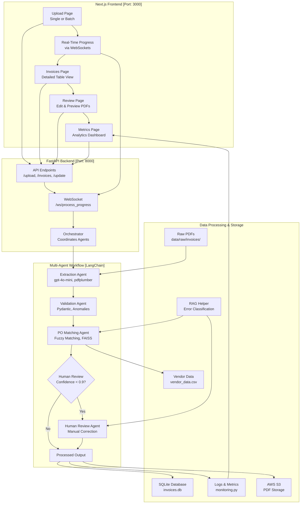

# 📊 Clear Ledger AP (Next.js Frontend)

[](https://www.python.org/downloads/)
[](https://nodejs.org/)
[](https://fastapi.tiangolo.com/)
[](https://nextjs.org/)
[](https://openai.com/)

## 🎯 Overview

A sophisticated invoice processing system that leverages LangChain's multi-agent workflow to automate extraction, validation, and purchase order (PO) matching. Built as a technical challenge for Brim's Agentic AI Engineer position, this solution reduces manual processing time by over 75% while ensuring high accuracy through intelligent error handling and human-in-the-loop review processes.

**Key Updates:**
- Migrated from JSON-based storage to SQLite (`invoices.db`) for invoice metadata, boosting scalability and query efficiency.
- Integrated AWS S3 for PDF storage with public read access, replacing local file storage for better reliability and scalability.

## 📋 Key Features

- **Intelligent Processing Pipeline**
  - Processes PDFs from `data/raw/invoices/` (35 invoices), now stored in AWS S3
  - Multi-agent system for extraction, validation, and matching
  - RAG-based error handling with FAISS using `data/raw/test_samples/` (5 faulty PDFs to minimize human review)
  - Asynchronous processing with SQLite-backed metadata storage

- **Modern Frontend Interface**
  - Next.js-powered dashboard
  - Real-time processing updates via WebSockets
  - Interactive invoice review system with S3-hosted PDF previews
  - Comprehensive metrics visualization

- **Enterprise-Grade Architecture**
  - FastAPI backend with WebSocket support
  - SQLite database (`invoices.db`) for structured data
  - AWS S3 for scalable PDF storage
  - Containerized deployment ready

## Development Journey

### Week 1: Foundation & Core Development

#### Day 1: Project Planning and Setup

- 🎯 **Objectives Achieved**
  - Organized detailed 10-day development roadmap
  - Analyzed technical challenge requirements
  - Initialized project structure

- 🛠️ **Technical Implementation**
  - Set up FastAPI backend and Next.js frontend
  - Installed core dependencies:
    - LangChain (0.2.16)
    - PDF processing (pdfplumber)
    - OCR capabilities (pytesseract)

#### Day 2: Invoice Processing Foundation

- 🎯 **Objectives Achieved**
  - Implemented core extraction logic
  - Established validation framework

- 🛠️ **Technical Implementation**
  - Developed InvoiceExtractionAgent with Pydantic models
  - Implemented PDF parsing and OCR pipeline
  - Created validation system with anomaly detection

#### Day 3: Intelligence & Error Handling

- 🎯 **Objectives Achieved**
  - Enhanced system reliability
  - Improved extraction accuracy

- 🛠️ **Technical Implementation**
  - Integrated FAISS-based RAG for error handling
  - Migrated from Mistral 7B to OpenAI's gpt-4o-mini API
  - Implemented performance monitoring
  - Added fallback mechanisms

#### Day 4: Advanced Features & Frontend

- 🎯 **Objectives Achieved**
  - Completed PO matching system
  - Enhanced user interface

- 🛠️ **Technical Implementation**
  - Built PurchaseOrderMatchingAgent with fuzzy matching
  - Migrated from Streamlit to Next.js
  - Implemented advanced frontend features

#### Day 5: System Refinement

- 🎯 **Objectives Achieved**
  - Resolved critical system issues
  - Enhanced user experience

- 🛠️ **Technical Fixes**
  1. **WebSocket Connectivity**
     - Issue: Connection failures during batch processing
     - Solution: Implemented proper WebSocket handling

  2. **File Upload Reliability**
     - Issue: 422 errors with invalid files
     - Solution: Enhanced error handling and user feedback

  3. **PDF Viewing System**
     - Issue: 404 errors in PDF preview
     - Solution: Restructured PDF storage and serving

  4. **Data Format Consistency**
     - Issue: Date format inconsistencies
     - Solution: Standardized date handling (yyyy-MM-dd)

  5. **Batch Processing UX**
     - Issue: Multiple submission issues
     - Solution: Implemented proper loading states and safeguards

#### Day 6: Stabilization and Bug Fixes

- 🎯 **Objectives Achieved**
  - Stabilized backend operations
  - Resolved frontend compatibility issues
  - Fixed critical bugs in processing pipeline
  - Resolved batch processing stalls
  - Restored PDF viewing functionality
  - Fixed infinite loading issues

- 🛠️ **Technical Implementation**
  1. **Backend Stabilization**
     - Fixed `uvicorn.run()` configuration
     - Optimized WebSocket connections
     - Enhanced error logging
     - Reduced WebSocket broadcast frequency
     - Improved PDF serving logic

  2. **Node.js Environment**
     - Updated to Node.js 20
     - Resolved dependency conflicts
     - Converted Next.js configuration

  3. **Frontend Fixes**
     - Implemented proper PDF validation
     - Enhanced review page logic
     - Fixed invoice processing feedback
     - Added robust error handling
     - Limited fetchInvoices retries
     - Improved PDF viewing error handling

  4. **Configuration Updates**
     - Migrated from `next.config.ts` to `next.config.js`
     - Updated package dependencies
     - Optimized build configuration

  5. **Critical System Improvements**
     - Fixed batch processing stalls at 19/35 or 34/35
     - Resolved PDF viewing 404 errors
     - Fixed 'Refreshing...' state on invoices page
     - Implemented graceful error handling
     - Enhanced WebSocket stability

- **More Technical Fixes**:
  - Merged `api/human_review_api.py` into `api/review_api.py`, consolidating review functionality into a single API module running on port 8000, eliminating redundancy.
  - Removed `workflows/pipeline.py` as its functionality is fully covered by `workflows/orchestrator.py`, ensuring a single, robust workflow manager.
  - Reviewed `frontend-nextjs/public/` directory and removed unnecessary SVG files (e.g., `file.svg`, `globe.svg`) not referenced in the application, reducing build size.
  - Verified `frontend-nextjs/src/pages/anomalies.tsx` integration, confirming it’s linked to the backend via `lib/api.ts` for anomaly retrieval, and kept as a functional page.
  - Ensured `lib/api.ts` only handles API client logic without duplicating backend processing, maintaining clear separation of concerns.

#### Day 7 and 8: Implemented SQLite and AWS (S3) Database

- 🎯 **Objectives Achieved**
  - Migrated from JSON storage to SQLite database for improved scalability
  - Implemented AWS S3 integration for PDF storage
  - Created migration script to handle data transition
  - Enhanced system reliability and performance
  - Optimized WebSocket connection stability

## Migration Challenges and Solutions

The transition to SQLite and AWS S3 brought significant improvements but wasn’t without its hurdles. Here’s how we tackled the key issues:

- **S3 Upload Errors**
  - **Problem:** Uploads failed due to ACL parameter conflicts.
  - **Fix:** Removed `'ACL': 'public-read'` from the upload code and configured bucket policies for public read access instead.

- **WebSocket Instability**
  - **Problem:** Connections dropped during batch processing, showing "CLOSING or CLOSED state" errors.
  - **Fix:** Added a `ConnectionManager` with heartbeat checks and reconnection logic to keep WebSockets rock-solid.

- **Database Migration Headaches**
  - **Problem:** Moving from `structured_invoices.json` to SQLite risked duplicates and data loss.
  - **Fix:** Wrote `migrate_json_to_db.py` to check for existing records, upload PDFs to S3, and ensure a smooth transition.

- **Anomalies Page Glitch**
  - **Problem:** The page showed "[object Object]" due to a bad `page` parameter.
  - **Fix:** Updated `anomalies.tsx` to enforce numeric `page` values, restoring proper data display.

These fixes made the system more robust, scalable, and ready for production!

## Architecture

### Project Structure

```plaintext
clear_ledger_nextjs/
├── Backend/Dockerfile
├── main.py
├── package.json
├── package-lock.json
├── docker-compose.yml
├── README.md
├── requirements.txt
├── .gitignore
├── invoices.db  # SQLite database for invoice metadata
├── agents/
│   ├── __init__.py
│   ├── base_agent.py
│   ├── extractor_agent.py
│   ├── fallback_agent.py
│   ├── human_review_agent.py
│   ├── matching_agent.py
│   ├── validator_agent.py
│       
├── api/
│   ├── __init__.py
│   ├── app.py
│   ├── review_api.py  
│       
├── config/
│   ├── __init__.py
│   ├── logging_config.py
│   ├── monitoring.py
│   ├── settings.py
│ 
├── data/
│   ├── processed/
│   │   └── anomalies.json
│   ├── raw/
│   │   └── invoices/ *pdfs
│   │   └── test_invoice.txt
│   │   └── vendor_data.csv
│   ├── temp/
│   │   └── … (temporary files)
│   └── test_samples/
│       └── … (sample faulty invoices for rag_helper.py)
├── data_processing/
│   ├── __init__.py
│   ├── anomaly_detection.py
│   ├── confidence_scoring.py
│   ├── document_parser.py
│   ├── ocr_helper.py
│   ├── po_matcher.py
│   ├── rag_helper.py
│       
├── frontend-nextjs/
│   ├── eslint.config.mjs
│   ├── Dockerfile
│   ├── next-env.d.ts
│   ├── next.config.ts
│   ├── package.json
│   ├── postcss.config.mjs
│   ├── tailwind.config.ts
│   ├── tsconfig.json
│   ├── lib/
│   │   └── api.ts
│   └── src/
│       ├── pages/
│       │   ├── _app.tsx
│       │   ├── anomalies.tsx  
│       │   ├── index.tsx
│       │   ├── invoices.tsx
│       │   ├── metrics.tsx
│       │   └── review.tsx
│       │   └── upload.tsx
│       ├── components/
│       │   └── Layout.tsx
│       └── styles/
│           └── globals.css
├── models/
│   ├── __init__.py
│   ├── invoice.py
│   ├── validation_schema.py
│       
└── workflows/
    ├── __init__.py
    ├── orchestrator.py  
```

### Architecture Diagram 

```plaintext
+-------------------+
|    Next.js UI     |
| (Production-ready)|
| - React, Next.js  |
| - Tailwind CSS    |
+-------------------+
           |
           +-----------+
                       |
                +------+------+
                | FastAPI     |
                | Backend     |
                | - WebSocket |
                |   Support   |
                +------+------+
                       |
           +-----------+-------------+
           |                         |
+-------------------+       +-------------------+
|   Extraction      |       |   Validation      |
|   Agent           |       |   Agent           |
| - gpt-4o-mini     |       | - Pydantic Models |
| - pdfplumber      |       |                   |
| - pytesseract     |       +-------------------+
+-------------------+                |
           |                         |
           +-----------+-------------+
                       |
                +------+------+
                | PO Matching |
                |    Agent    |
                | - Fuzzy      |
                |   Matching   |
                +------+------+
                       |
                +------+------+
                | Human Review|
                |    Agent    |
                | - Confidence|
                |   < 0.9     |
                +------+------+
                       |
                +------+------+
                | Fallback    |
                |    Agent    |
                | - FAISS RAG  |
                +------+------+
                       |
           +-----------+-------------+
           |                         |
+-------------------+       +-------------------+
| SQLite Database  |       |    AWS S3         |
| - invoices.db     |       | - PDF Storage     |
| - Metadata        |       | - Public Read     |
+-------------------+       +-------------------+
```



## Setup Guide

### Prerequisites

- Python 3.12+
- Node.js 20.x
- Virtual environment tool
- Git
- OpenAI API key
- AWS account with S3 access

### Step-by-Step Installation

1. **Clone Repository**

### Setup Guide (Dockerized)

1. **Clone the repository**:
   ```bash
   git clone https://github.com/yourusername/clear_ledger_nextjs.git
   cd clear_ledger_nextjs
   ```

2. **Create an environment file**:
   ```bash
   # Create .env file in root directory with required credentials
   cat > .env << EOL
   OPENAI_API_KEY=your_api_key_here
   AWS_ACCESS_KEY_ID=your_access_key
   AWS_SECRET_ACCESS_KEY=your_secret_key
   BUCKET_NAME=your_bucket_name
   EOL
   ```

3. **Build & Run with Docker**
   ```bash
   # Build and run with Docker Compose
   docker compose up --build -d
   ```

4. **Access the Application**
   - Frontend: http://localhost:3000
   - Backend: http://localhost:8000/docs

5. **Using Pre-built Images** (Optional)
   ```bash
   # Pull images from Docker Hub
   docker pull chris9753/clear_ledger_nextjs_backend:latest
   docker pull chris9753/clear_ledger_nextjs_frontend:latest
   ```

### Using Pre-built Images

1. **Create a docker-compose.yml**:
   ```yaml
   version: '3.8'
   services:
     backend:
       image: chris9753/clear_ledger_nextjs_backend:latest
       ports:
         - "8000:8000"
       environment:
         - OPENAI_API_KEY=${OPENAI_API_KEY}
         - AWS_ACCESS_KEY_ID=${AWS_ACCESS_KEY_ID}
         - AWS_SECRET_ACCESS_KEY=${AWS_SECRET_ACCESS_KEY}
         - BUCKET_NAME=${BUCKET_NAME}
       volumes:
         - ./data:/app/data
         - ./invoices.db:/app/invoices.db

     frontend:
       image: chris9753/clear_ledger_nextjs_frontend:latest
       ports:
         - "3000:3000"
       depends_on:
         - backend
   ```

### CI/CD Pipeline

This project uses GitHub Actions to automatically build and push Docker images to Docker Hub whenever changes are pushed to the repository.

Pre-built images are available at:
- Backend: `chris9753/clear_ledger_nextjs_backend:latest`
- Frontend: `chris9753/clear_ledger_nextjs_frontend:latest`

The CI/CD pipeline has been updated to include proper handling of SQLite databases and AWS S3 configurations.

### Core Workflows

1. **Process Invoices**
   - Upload at `/upload`
   - View at `/invoices`
   - Review at `/review`
   - Monitor at `/metrics`

2. **System Features**
   - Automatic duplicate detection
   - Confidence scoring (≥0.9 auto-process, <0.9 review)
   - Asynchronous processing
   - Comprehensive logging

### Dependencies

#### Frontend

- Next.js ^14.2.24
- React ^18.2.0
- React Hook Form ^7.50.1
- TailwindCSS ^3.4.1
- TypeScript ^5.3.3

#### Backend

- FastAPI
- LangChain
- OpenAI
- PDFPlumber
- Pytesseract

## Project Progress

### Completed (Days 1-7)

- ✅ Multi-agent system implementation
- ✅ Frontend migration (Streamlit → Next.js)
- ✅ OpenAI API integration
- ✅ RAG-based error handling
- ✅ Critical system improvements
- ✅ Project Refinement and Optimization
- ✅ Documentation & Testing

### Remaining Tasks (Days 8-10)
- Day 8: Performance Optimization & Submission

## Database Integration Update (February 26 2025)

The project has migrated from JSON-based storage to SQLite and AWS S3 for improved scalability:
- SQLite database (`invoices.db`) for invoice metadata
- AWS S3 for PDF document storage
- Removed dependency on `structured_invoices.json`

### Updated Setup Instructions

1. **Database Setup**
   ```bash
   # Place invoices.db in project root (if not using the migration script)
   python migrate_json_to_db.py  # Migrates data from structured_invoices.json if needed
   ```

2. **AWS S3 Configuration**
   - Create an S3 bucket for PDF storage
   - Set environment variables in `.env`:
     ```
     AWS_ACCESS_KEY_ID=your_access_key
     AWS_SECRET_ACCESS_KEY=your_secret_key
     BUCKET_NAME=your_bucket_name
     ```
   - Configure bucket policy for public read access:
     ```json
     {
       "Version": "2012-10-17",
       "Statement": [
         {
           "Sid": "PublicReadGetObject",
           "Effect": "Allow",
           "Principal": "*",
           "Action": "s3:GetObject",
           "Resource": "arn:aws:s3:::your-bucket-name/*"
         }
       ]
     }
     ```

3. **Install Dependencies**
   ```bash
   pip install -r requirements.txt  # Backend
   cd frontend-nextjs && npm install  # Frontend
   ```

4. **Run the Application**
   ```bash
   # Terminal 1 - Backend
   python api/app.py  # Runs on port 8000

   # Terminal 2 - Frontend
   cd frontend-nextjs && npm run dev  # Runs on port 3000
   ```

5. **Post-Migration**
   - Archive `data/processed/structured_invoices.json` after successful migration
   - Verify data in SQLite database using SQLite browser or CLI:
     ```bash
     sqlite3 invoices.db "SELECT COUNT(*) FROM invoices"
     ```
   - Test S3 file uploads and access using the web interface

**Built with ❤️ for the Technical Challenge**